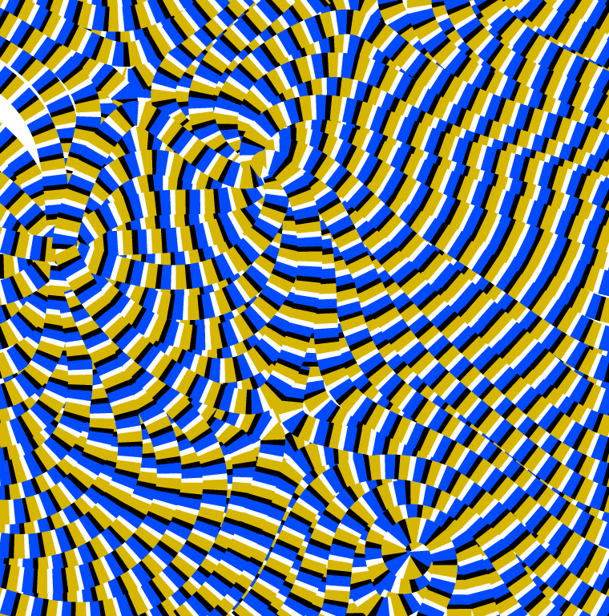
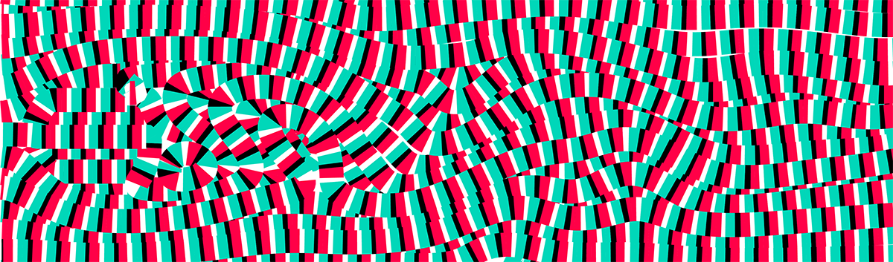

# Self-animating-images
### Illusory Motion Using Repeated Asymmetric Patterns Code



A little project to create optical illusions of moving images from arbitrary vector fields (e.g. fluid flow).
Presented in a computer graphics seminar in summer '15. Based on the work by [Chi et al.](http://graphics.csie.ncku.edu.tw/SAI/)

### Requirements:
* [CGAL library](https://www.cgal.org/)
* [Asymptote](http://asymptote.sourceforge.net/)

### Usage
Compile code with:
```
ccmake .
[Press c twice, possibly you need to adapt the path to CGAL. Then press g] 
make
```

Then run
```
./code
   <Streamline-Distance>
   <RAP-Length>
   <RAP-width>
   <vector-file>
```
or only `./code <vector-file>`

Example input-files are in subdirectory `vector_fields`. 
Use 
```
asy *.asy
```
to render output images.



### Todo
* Implement the length variation of RAPs in order to maximize contrast between streamlines
